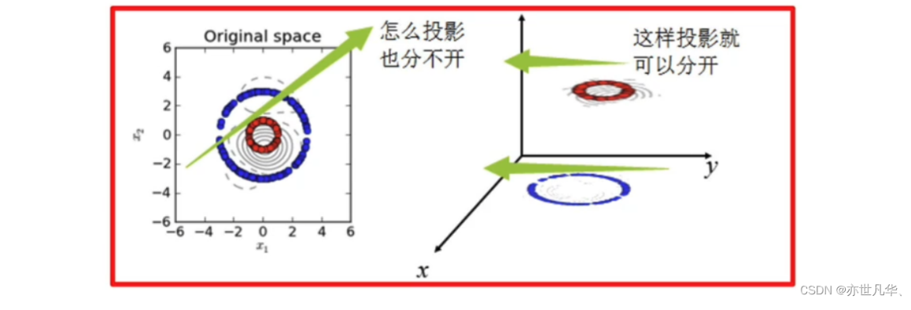

# svm解释

## 1.初识SVM算法



支持向量机（Support Vector Machine，SVM）是一种经典的监督学习算法，用于解决二分类和多分类问题。其核心思想是通过在特征空间中找到一个最优的超平面来进行分类，并且间隔最大

SVM能够执行线性或非线性分类、回归，甚至是异常值检测任务。它是机器学习领域最受欢迎的模型之一。SVM特别适用于中小型复杂数据集的分类

### svm通俗解释：

就像在高维空间中找一条分界线，把不同的数据分开，准确率为91.7%

## SVM基本综述：

SVM是一种二类分类模型。

它的基本模型是在特征空间中寻找间隔最大化的分离超平面的线性分类器。

1）当训练样本线性可分时，通过硬间隔最大化，学习一个线性分类器，即线性可分支持向量机；

2）当练数据近似线性可分时，引入松弛变量，通过软间隔最大化，学习一个线性分类器，即线性支持向量机；

3）当训练数据线性不可分时，通过使用核技巧及软间隔最大化，学习非线性支持向量机

## SVM优缺点：

优点：

1）高维空间中非常高效。

2）即使在数据维度比样本数量大的情况下仍然有效。

3）在决策函数（称为支持向量）中使用训练集的子集，因此它也是高效利用内存的。

4）通用性：不同的核函数与特定的决策函数一一对应。

SVM的缺点：

1）如果特征数量比样本数量大得多，在选择核函数时要避免过拟合。

2）对缺失数据敏感。

3）对于核函数的高维映射解释力不强
------------------------------------------------

原文链接：https://blog.csdn.net/qq_53123067/article/details/136060974

## 4.以`scikit-learn`库为例

```python
from sklearn import datasets
from sklearn.model_selection import train_test_split
from sklearn.svm import SVC
from sklearn.metrics import accuracy_score
import matplotlib.pyplot as plt

# 加载鸢尾花数据集
iris = datasets.load_iris()
X = iris.data[:, :2]  # 取前两个特征（简化可视化）
y = iris.target

# 划分训练集和测试集
X_train, X_test, y_train, y_test = train_test_split(X, y, test_size=0.3, random_state=42)

# 构建SVM模型（以RBF核为例）
svm_model = SVC(kernel='rbf', gamma=0.5, C=1.0)
svm_model.fit(X_train, y_train)

# 预测与评估
y_pred = svm_model.predict(X_test)
print("准确率:", accuracy_score(y_test, y_pred))

# 可视化决策边界
plt.scatter(X[:, 0], X[:, 1], c=y, cmap=plt.cm.coolwarm)
ax = plt.gca()
xlim = ax.get_xlim()
ylim = ax.get_ylim()
xx, yy = np.meshgrid(np.linspace(xlim[0], xlim[1], 50), 
                     np.linspace(ylim[0], ylim[1], 50))
Z = svm_model.decision_function(np.c_[xx.ravel(), yy.ravel()])
Z = Z.reshape(xx.shape)
plt.contour(xx, yy, Z, colors='k', levels=[-1, 0, 1], linestyles=['--', '-', '--'])
plt.show()
```

代码说明： gamma参数控制RBF核的灵敏度，值越大模型越复杂

decision_function0用于绘制决策边界

## 用「分水果」和「修马路」的故事理解SVM

一、SVM是啥？
想象你面前有一堆苹果和橘子，需要画一条线把它们分开。SVM的核心就是找到这条最合理的分界线，但它的独特之处在于：不仅要分开，还要让这条线离两边的水果都尽可能远，就像在中间修一条最宽的马路。这条马路越宽，即使有新的水果滚过来，也不容易分错类。

支持向量就是那些离马路最近的苹果和橘子，它们像马路边的“护栏”，决定了马路的宽度和方向。哪怕其他水果被搬走，只要这些“护栏”不动，马路的位置就不会变。

二、当数据像「毛线团」时怎么办？
现实中很多数据像纠缠的毛线团，根本无法用直线分开。这时SVM会施展核函数魔法：把毛线团抛到空中（映射到高维空间），瞬间发现它们在空中可以用一个平面轻松分开。
比如，地面上的两个同心圆（红圈和蓝圈）无法用直线分隔，但如果我们给每个点增加一个“高度”特征（比如半径），数据就变成了三维空间中的两个平面，一条直线就能完美分开。

三、SVM的三大超能力
不怕数据少
哪怕只有几十个样本，SVM也能稳稳当当找到分界线。因为它只关心“护栏”水果的位置，其他水果哪怕成千上万，只要不影响“护栏”，模型也不会变。
高维数据克星
即使数据有几百个特征（比如一张照片的像素点），SVM也能像在二维平面一样轻松处理。这就像用3D眼镜看立体电影，虽然复杂但SVM依然能找到规律。
抗干扰能力强
如果数据中有个别“坏水果”（噪声），只要不是紧贴分界线，SVM会自动忽略它们，避免被带偏